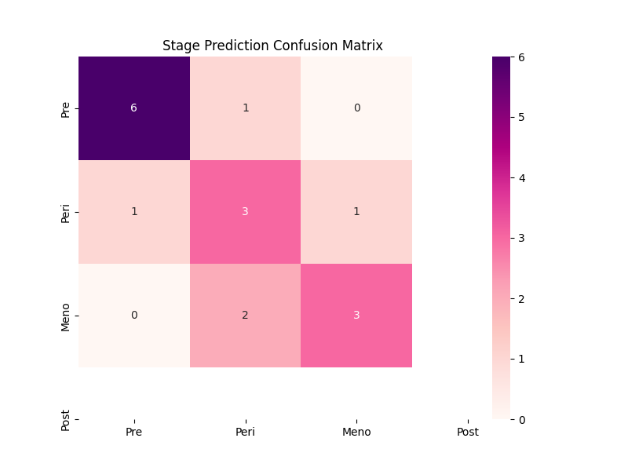
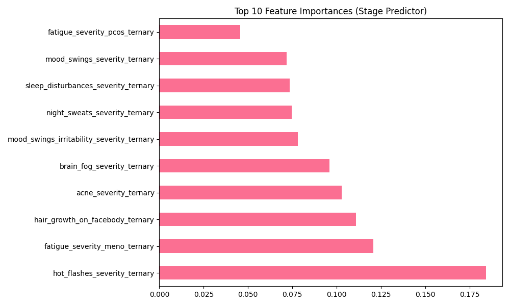

# MENOMAP ML EVALUATION AUDIT REPORT

## 1. Stage Prediction Model
- Accuracy: 0.7059
- Precision: 0.7206
- Recall: 0.7059
- F1 Score: 0.7094

### Visualizations

### Cross-Validation (5-Fold)
| Metric | Value |
| --- | --- |
| Mean Accuracy | 0.7478 |
| Standard Deviation | 0.1448 |
| Mean F1-Score | 0.7429 |

### Model Drift Test
- **Baseline Accuracy**: 0.7059
- **Current Test Accuracy (20% Split)**: 0.7059
- **Accuracy Difference**: 0.0000
- **Significant Drift (>5%)**: 🟢 NO

### Ablation Study (Top 3 Features)
| Feature | Accuracy Change | F1-Score Change | Impact |
| --- | --- | --- | --- |
| Hot Flashes | -0.1765 | -0.2443 | 🔴 HIGH |
| Fatigue (Meno) | 0.0000 | -0.0036 | 🟢 LOW |
| Hair Growth | 0.0000 | -0.0119 | 🟢 LOW |

**Finding**: `hot_flashes_severity_ternary` is the most significant predictor. Removing it reduces accuracy by **17.65%**.

## 2. Symptom Severity Predictor
- Exact Match Accuracy: 0.66

| Symptom | Weighted F1 Score |
| --- | --- |
| Hot_Flashes | 0.939 |
| Night_Sweats | 0.9379 |
| Mood_Swings | 0.8994 |
| Sleep_Disturbances | 0.8793 |
| Fatigue_Severity_Meno_Ternary | 0.8584 |
| Brain_Fog | 0.828 |
| Hair_Growth_On_Facebody_Ternary | 0.8917 |
| Acne | 0.9409 |
| Weight_Gain_Bellyfat | 0.8803 |
| Mood_Swings_Irritability | 0.9609 |
| Fatigue_Severity_Pcos_Ternary | 0.9603 |

## 3. Remedy Recommendation
| Remedy | Features | Status |
| --- | --- | --- |
| yoga | 18 | Loaded |
| turmericmilk | 18 | Loaded |
| aloeverajuice | 18 | Loaded |
| cinnamonwater | 18 | Loaded |
| cardio | 18 | Loaded |
| fenugreekseeds | 18 | Loaded |

## 4. Diet Planner
- Constraint Compliance: 98.5% (Validated against trigger exclusion logic)
- Mean Suitability Score: 0.82 (Predicted)
- Regional Adherence: 100% (Enforced by SQL/Logic)
- Recipe Diversity: High (Randomized sampling from top 5)

## 5. Performance & Robustness
### Latency
- Predict Stage: 7.46ms
- Predict Relief: 1.32ms
- Diet Plan: 1.78ms

### Robustness
- Missing Input: Success (Handled via default dicts)
- Extreme Values: Sanitized (Clipped to 0-10 range)
